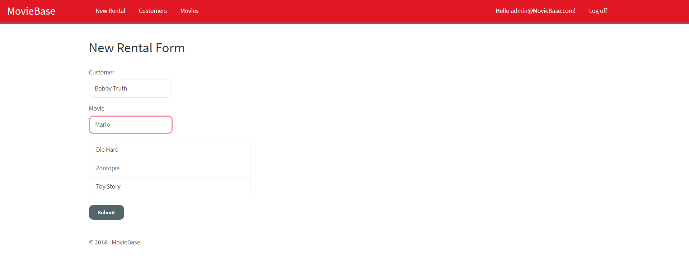

# Movie Base
> A browser application using ASP.NET to aid registered users handling their movie rentals.

	https://yamilburgos.github.io/MovieBase

## Tech Stack
- Visual C#
- ASP.NET MVC
- Entity Framework
- Bootstrap
- toastr
- Bootbox
- CSS
- Visual Studio Community 2017
- Google Chrome

## Information
An app that provides the ability to rent out a movie (if available), manage multiple customers and sort out both listed movies and customers. Only registered customers can rent or return movies.

## Meta
[Yamil Burgos](https://github.com/yamilburgos/) – yamil.burgos1293@gmail.com

## Contributing
1. Fork it (<https://github.com/yamilburgos/MovieBase/fork>)
2. Create your feature branch (`git checkout -b feature/fooBar`)
3. Commit your changes (`git commit -am 'Add some fooBar'`)
4. Push to the branch (`git push origin feature/fooBar`)
5. Create a new Pull Request